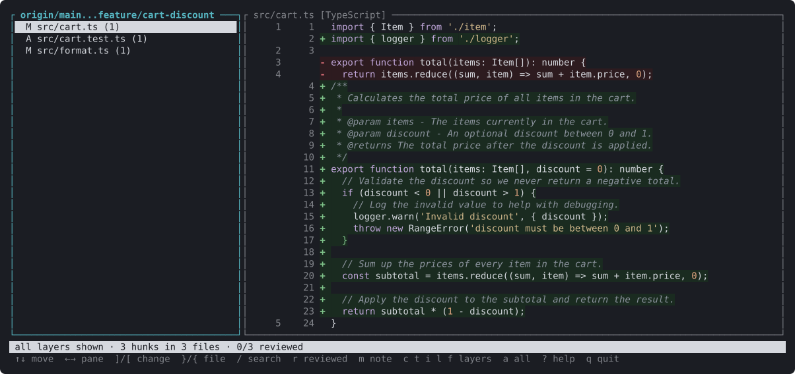
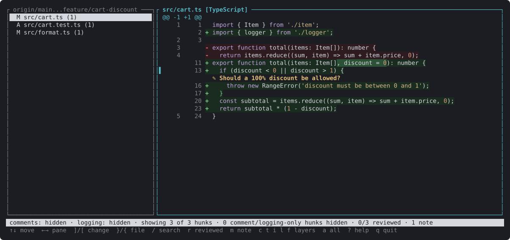
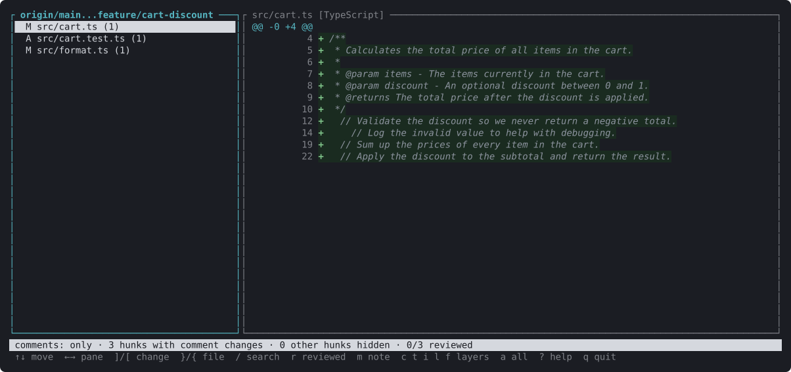
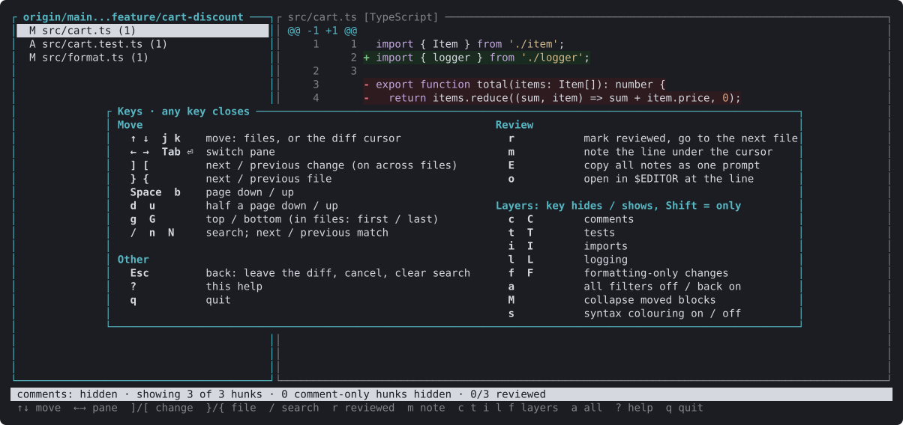

# declutter-diff

Review AI-generated diffs with the comments and tests toggled out — or with nothing *but* them.
See [prod.md](prod.md) for the idea, the design and the roadmap.

## What it looks like

An AI-written change to a small cart module, everything shown — the way a plain diff
reads:



The same change with comments and logging hidden (`c`, `l`): only the code is left, with a
review note (`m`) on the line that needs a decision:



Comments only (`C`) — check what the AI claims its code does, on its own:



`?` lists every key:



The pictures are drawn by the viewer itself: `cargo run --example screenshots` regenerates
them in `docs/images/`.

## Status

Prototype: five layers, each shown, hidden or shown on its own.

- **Comments** (and Python docstrings) in Swift, TypeScript/TSX, JavaScript and Python.
- **Tests**, per file: test directories and file-name conventions in any language
  (`Tests/`, `FooTests/`, `__tests__/`, `FooTests.swift`, `foo.test.ts`, `test_foo.py`, …),
  plus Swift, Python and TypeScript files that import a test framework.
- **Imports**: `import` statements (and `export … from` re-exports).
- **Logging**: statements that only log — `print(…)`, `NSLog`, `os_log`, `console.*(…)`, and
  `debug/info/warn/error/…` calls on a `logger`, `log`, `logging` or `console` receiver.
- **Formatting**: changes that only move whitespace — re-indenting, re-spacing, re-wrapping
  a statement over more or fewer lines, added blank lines. When hidden, the new layout stays
  visible as context. Indentation counts as code in Python and in files without a grammar.

## Build

```sh
cargo build --release
# binary: target/release/declutter
```

## Use

Run inside a git repository:

```sh
declutter                                  # the branch you're on vs main, uncommitted work included
declutter <PR URL>                         # a GitHub or Azure DevOps pull request
declutter pr 42                            # PR 42 of the repository origin points at
declutter feature/login                    # a branch vs main, from where it split off
declutter feature/login --base develop     # … vs another branch
declutter --base develop                   # the branch you're on vs develop
declutter HEAD                             # only your uncommitted work
declutter main...feature                   # any range, as in git diff
declutter HEAD~3                           # a revision vs the working tree
declutter --staged                         # HEAD vs the index
declutter --print                          # print instead of opening the viewer
declutter -p --comments only               # print only the comment changes
declutter --tests hidden                   # start with test files left out
```

- **Pull requests** — paste the URL from the browser. The PR is fetched into
  `refs/declutter/pr/<n>/` (no local branch is created or moved) and shown as the PR page
  shows it. It is read from the merge ref both hosts publish, so all it needs is git's own
  access to the remote; only when there is no merge ref (a conflicting or closed PR) does it
  ask the `gh` or `az` CLI for the branches.
- **No arguments** — on a branch, everything it changes: its commits since it split off from
  the main branch plus whatever isn't committed yet, untracked files included. On the main
  branch itself (or a detached HEAD) it shows just the uncommitted work.
- **Branches** — a local branch, or one on `origin` (fetched first if you don't have it yet),
  is compared with the main branch: what `origin/HEAD` points at, else `main` or `master`.
  `--base` picks another. Naming the main branch itself, or any other revision, compares it
  with your working tree.

The file list's title says what is being compared (`origin/main...feature/login`, `PR 42`).

Viewer keys:

| Key | Action |
|-----|--------|
| `↑` `↓` / `j` `k` | move through the files, or the diff's line cursor |
| `←` `→` / `Tab` / `Enter` | switch between the file list and the diff |
| `]` `[` | next / previous change, on into the next file |
| `}` `{` | next / previous file |
| `Space` `b` | page down / up (`d` `u` half a page) |
| `g` `G` | top / bottom of the diff (first / last file in the file list) |
| `/` `n` `N` | search the diff; next / previous match (smart case) |
| `r` | mark the file reviewed and jump to the next unreviewed one (again to unmark) |
| `m` | leave a note on the line under the cursor |
| `E` | copy all notes to the clipboard as one prompt for a coding agent |
| `o` | open the file in `$VISUAL` / `$EDITOR` at the cursor's line |
| `c` `t` `i` `l` `f` | hide / show comments, tests, imports, logging, formatting-only changes |
| `C` `T` `I` `L` `F` | show only that layer; press again to go back |
| `a` | all filters off (everything shown); press again to put them back |
| `M` | collapse moved blocks to their one-line marker, or expand them |
| `s` | syntax colouring on / off (`--no-syntax` starts with it off) |
| `?` | every key |
| `Esc` | back: leave the diff, close a prompt, clear the search |
| `q` | quit |

Toggling a layer keeps the cursor on the same line of the file (or the closest one still
shown), so you can flip comments on and off without losing your place.

Layers combine: everything set to *hidden* is cut out together. A layer set to *only*
wins — with comments on *only* you see just the comment changes, whatever else is hidden.

**Moved code** (`M` collapses). A block of three or more lines removed in one place and added in another —
same file or a different one, re-indented or not — is drawn in its own tint with a marker
(`⇄ 14 lines moved to Checkout.swift:173`) at each end, in the viewer and in `--print`.

The status line always says what is hidden, e.g.
`comments: hidden · tests: hidden · showing 7 of 12 hunks · 5 comment-only hunks hidden · 4 test files hidden`.

Review marks are saved per repository in `.git/declutter/reviewed.tsv` (shared by
worktrees, never committed). A mark belongs to the exact change, so a file you reviewed
shows up unreviewed again as soon as a new commit touches it.

Notes belong to the review they were left in — a pull request, or a range such as
`origin/main...feature` — and only show up there. They are kept in
`.git/declutter/notes.json`. `E` copies the review's notes as a prompt ("Please address
these review comments… 1. `path:line`: note") and also saves it to
`.git/declutter/review-notes.md`; `declutter notes` prints every note and
`declutter notes --clear` deletes them.

**Posting notes to the pull request.** When you quit a review of a PR, declutter lists the
notes you left and asks `Post 3 comments to PR 42? [y/N]`. Only `y` posts: each note
becomes a comment on its line (a thread in Azure DevOps via `az rest`, a review comment on
GitHub via `gh api`, on the file when GitHub won't take that line), as whoever those CLIs
are signed in as. Posted notes leave the local store; any that fail stay, with the error.

`o` knows the line syntax of VS Code (and Cursor/Windsurf), Sublime, Zed, Helix, Vim/Neovim,
nano, Emacs, micro, Xcode (`xed`) and JetBrains IDEs; terminal editors take over the screen
until you quit them. With no editor set it uses the system opener. It opens the working-tree
file, which is the reviewed version unless you're reviewing an older range.

## Test

```sh
cargo test
```
